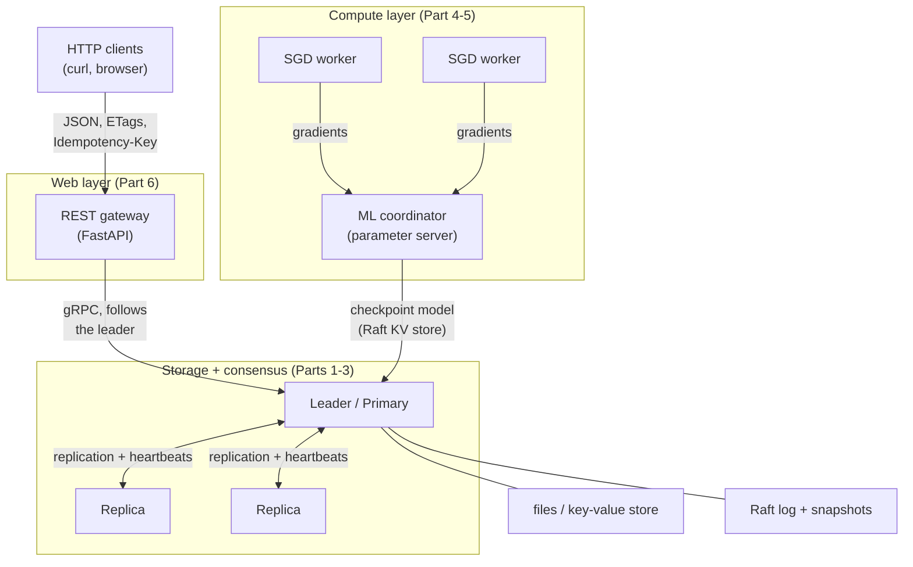

# Many-As-One — Distributed Storage & Compute Stack

A from-scratch distributed systems project I built in **Python + gRPC / Protocol Buffers**.
It spans the storage, consensus, compute and web layers of a distributed system: a
replicated file system with client-side caching, two replication strategies (primary-backup
and Raft), a Raft-backed key-value store, a fault-tolerant data-parallel ML trainer that
runs on top of them, and a REST API that serves the store over HTTP.

I named it *Many-As-One* because that is the core idea — replication and consensus make
**many** independent machines behave as **one** consistent system.

> **Tech:** Python, gRPC, Protocol Buffers, FastAPI, Pydantic, WebSockets, threading,
> `cryptography` (Fernet), Make.
> **Concepts:** RPC, client caching & cache coherence, idempotent retries, leader election,
> log replication (Raft), primary-backup replication, linearizability, snapshotting,
> data-parallel SGD / parameter server, REST API design (ETags, conditional requests,
> idempotency keys).

---

## Highlights

- I built **two RPC layers by hand** — a gRPC file service *and* an equivalent
  length-prefixed, encrypted TCP transport (pickle + Fernet) — so the caching/versioning
  logic is transport-agnostic.
- My file system gives **close-to-open consistency** with a version-validated client cache:
  unchanged files are served from local cache with zero network transfer, and writes commit
  atomically on `close`.
- I implemented **two replication strategies**, with a written rationale for choosing
  between them: a complete **Raft** consensus engine (leader election, log replication with
  fast conflict backtracking, persistence, snapshot install) and a leaner **primary-backup**
  cluster with failover and re-sync.
- I reused the Raft engine to build a **key-value store (mini-etcd)**: linearizable
  `Put`/`Delete`/compare-and-swap (by value, or by version to rule out the ABA problem),
  leader-served reads with an optional ReadIndex barrier, and **exactly-once retries that
  survive failover** — the de-duplication table is part of the replicated state machine, so
  a new leader recognises a write its predecessor already committed.
- Every node exposes a **status RPC** (role, term, commit index, per-follower replication
  progress) and a **fault-injection switch** that cuts it off from the cluster; my tests use
  it to isolate the leader and prove a retried write is still applied exactly once.
- I put the store on the web with a **REST API (FastAPI)**: a key's version becomes its
  `ETag`, compare-and-swap becomes `If-Match` (optimistic concurrency, `412` on a conflict),
  retries carry an `Idempotency-Key`, and leader failover happens inside the gateway, so an
  HTTP client sees a slower response instead of an error. Errors are RFC 9457 problem
  details, and a WebSocket streams live cluster status.
- On top of all that I built a **distributed ML trainer** — data-parallel logistic
  regression (a parameter server) whose model I checkpoint into the Raft KV store, so
  training resumes after a coordinator crash.
- I found and fixed a real **lost-write linearizability bug** in my Raft commit path, with a
  hermetic regression test that reproduces it.

---

## Repository layout

| Directory | What's inside |
|---|---|
| `part1_filesystem/fs/` | gRPC file server + caching client stub (`fs.proto`) |
| `part1_filesystem/fs_wo_grpc/` | Same semantics over a hand-rolled encrypted TCP transport |
| `part2_3_replication/` | Raft engine (`raft_node.py`), Raft KV store / mini-etcd (`raft_kv_server.py`, `KV.md`), and the fault-tolerance client |
| `part2_3_replication/replication/` | Primary-backup cluster + 32-test suite |
| `part4_5_compute/` | Distributed data-parallel ML trainer (parameter server) with model checkpointing |
| `part6_web/` | REST API gateway (FastAPI): controller, service and gRPC-client layers, plus hermetic and live tests |
| `DesignDoc_P*.md` | Per-part design documents |

> The storage parts build incrementally, so the shared file-system client (`client_stub.py`,
> `client.py`) recurs in a couple of folders and `fs.proto` diverges between the simple
> Part 1 version and the idempotent Parts 2–3 version. This is deliberate — each part runs
> on its own — rather than a single shared package.

---

## Architecture



---

## Quick start

**Prerequisites:** Python 3.10+ and the packages in [`requirements.txt`](requirements.txt).

```bash
pip install -r requirements.txt
```

gRPC stubs (`*_pb2.py`) are **generated**, not committed — each part has a `make proto`
(or `setup_raft.sh` / `generate_proto.sh`) step shown below.

### Part 1 — File system

```bash
cd part1_filesystem/fs
make proto && make run-server        # gRPC file server on :50051
make run-client                      # in another terminal
# encrypted non-gRPC variant:
cd ../fs_wo_grpc && make install-deps && make run-server
```

### Parts 2 & 3 — Fault tolerance, replication, and the KV store

```bash
cd part2_3_replication/replication   # primary-backup cluster + 32-test suite
python3 -m venv venv && ./venv/bin/pip install grpcio grpcio-tools
bash generate_proto.sh
./venv/bin/python tests/run_local.py           # 32 tests, incl. kill/restart fault injection

cd ..                                # Raft + the KV store (mini-etcd)
./setup_raft.sh
python3 test_raft_commit_safety.py             # hermetic Raft regression test (no cluster)
python3 test_raft_status_isolation.py          # hermetic status + fault-injection tests
./start_kv_cluster.sh                          # 3-node KV store on :50051-:50053
python test_kv_cluster.py                      # functional, exactly-once and failover tests
python3 test_kv_state_machine.py               # hermetic KV state-machine tests
```

See [`part2_3_replication/KV.md`](part2_3_replication/KV.md) for the KV store's API and
consistency model.

### Part 4 & 5 — Distributed ML training

```bash
cd part4_5_compute
make train                           # end-to-end: generates data, trains, asserts convergence
# or run it by hand:
make data
make run-coordinator WORKERS=3       # in one terminal
make run-worker WORKERS=3            # in another terminal
# durable model checkpoints in the Raft KV store (start it on ports 5105x first):
#   (cd ../part2_3_replication && ./start_kv_cluster.sh nodes_config_kv.json)
make run-coordinator-kv WORKERS=3
```

See [`DesignDoc_P45.md`](DesignDoc_P45.md) for the training design.

### Part 6 — Web gateway (REST API)

```bash
pip install -r part6_web/requirements.txt
cd part6_web                         # with the KV store running on :50051-:50053 (Parts 2 & 3)
fastapi dev gateway/main.py          # http://127.0.0.1:8000/docs
python test_gateway_api.py           # 28 hermetic tests (no cluster needed)
python test_gateway_live.py          # end to end: failover and loss of majority, over HTTP
```

See [`part6_web/README.md`](part6_web/README.md) for the API, the status codes and the design.

---

## Consistency & fault-tolerance guarantees

| Component | Guarantee | Boundary / known trade-off |
|---|---|---|
| **File system** | Close-to-open consistency; commit-on-close; version-validated client cache | Concurrent writers are last-writer-wins (whole-file overwrite) |
| **File-system retries + dedup** | At-least-once delivery + `(client_id, seq_num)` dedup → effectively at-most-once on a stable leader | The file system's dedup state is per-node and not replicated across failover (the KV store's is) |
| **Primary-backup** | Stays available through a single-node failure; any replica serves reads; transparent client redirect on failover | Acked-write durability needs a write quorum; split-brain possible without fencing (future work) |
| **Raft engine** | Linearizable replicated log; leader election; crash-durable term/log; snapshot install | See engineering note below |
| **Raft KV store** | Linearizable `Put`/`Delete`/CAS (by value or version) through the log; exactly-once retries across failover via a replicated session table; leader-served reads with optional ReadIndex barrier | No log compaction yet; no PreVote, so a rejoining isolated node forces one extra election |
| **ML trainer** | Data-parallel bulk-synchronous SGD; model checkpointed to the replicated KV store, so training resumes after a coordinator crash | One coordinator process at a time; synchronous (a straggler slows the epoch) |
| **Web API** | ETag / `If-Match` optimistic concurrency; a write is applied at most once per `Idempotency-Key`, even across failover; failover handled within a 12 s request deadline; `503` = not applied, `504` = outcome unknown | No authentication or rate limiting yet; `DELETE` has no `If-Match` |

---

## Engineering notes

**A lost-write bug I found and fixed in Raft.** My `append_entry()` waited for its entry to
commit using a notification keyed by **log index alone**, and the applier fired it for
whatever entry ended up committed at that index. Because a single index can hold different
entries across terms, a leader that appended a client's write, lost leadership, and saw a new
leader overwrite that index would wake the client call with the *wrong* entry's result and
report **success for a write that had been discarded**. I fixed it by tagging each waiter
with its entry's `(term, client_id, seq_num)`, failing pending waiters on step-down so the
client retries the new leader, and verifying entry identity in the applier. It is covered by
a hermetic regression test that reproduces the exact interleaving without a network.

**Known open trade-offs (future work):**
- *Primary-backup write durability:* the primary acknowledges a write after a best-effort
  replication attempt rather than a confirmed quorum; a write quorum (or using the Raft path)
  closes this.
- *Split-brain fencing:* primaries never step down and RPCs carry no epoch, so a stalled-then-
  resumed primary can coexist with a newly elected one. Monotonic epoch/fencing tokens fix this.
- *Idempotency across failover (file system):* done for the KV store, whose de-duplication
  table now lives in the replicated state machine; the file-system build still keeps its
  cache per node and would get the same fix.

---

## Author & license

I built this project (John Twipraham Debbarma). Released under the [MIT License](LICENSE).
